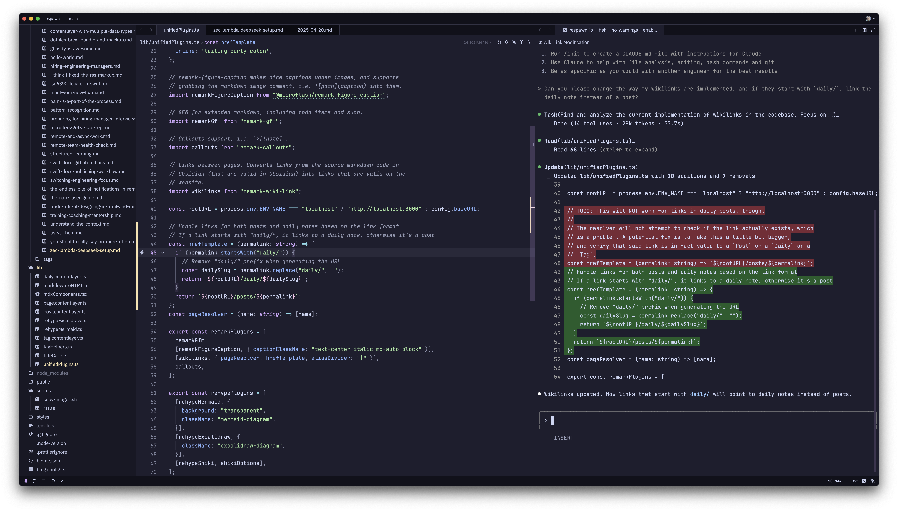

I got the memo pretty late, but you can just run Claude Code in a terminal in a split pane in any editor, and get as close to Cursor-style agentic IDEs as you need?

The setup for this is embarrasingly easy — install Claude with ` npm install -g @anthropic-ai/claude-code` and launch it in a terminal inside of your IDE. Happy coding.
