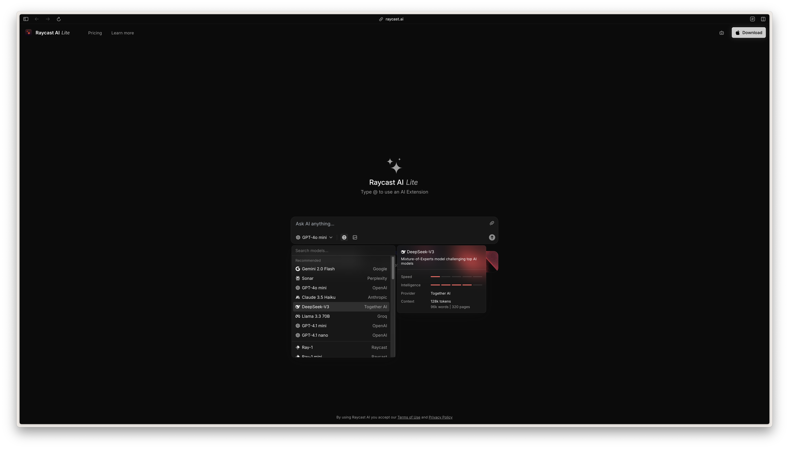

Raycast, my favorite _app launcher_ for Mac OS, shipped https://raycast.ai — an LLM chat demo with a bunch of signup prompts. I can probably name 20 chat / research / knowledge base search products out there, and they all are roughly the same thing.

Don't get me wrong, I'm a paid user on an annual plan for this thing, with AI bells and whistles included. But why does raycast.ai exist on it's own is beyond me. There _are better chats_ that are free (ahem, https://lambda.chat), and it does not really demonstrate why Raycast itself is so cool (local ask-style tools with highly specialized Raycast models).

This commoditization is going to be a bloodbath.
