# Airbyte in 2024: better extensibility primitives

I've been at Airbyte for a full year, conviniently aligned with calendar years. And since I'm one of the (un)lucky people who identify themselves too much with their work, here's my year in review.

<WithAside>
But first, let's see how I got here. Back in 2023, I had _a wake up moment_ and realized that just wanting to work on dev tools not enough, I should probably actively do something about it. I contributed to a few things, and started talking to a few companies, [which you can guess based on what I contributed to](https://github.com/pulls?q=is:merged+is:pr+author:natikgadzhi+archived:false+updated:2023-01-01..2023-12-31) 🙃

<Aside>
Assuming `SwiftSyntax` is now bundled with `Swift` itself, a piece of code that I've written, however miniscule and insignificant, is now in every iPhone.
</Aside>
</WithAside>
Ultimately, I decided to join Airbyte as an engineering manager on Extensibility team. First few weeks, perhaps even months, I was raging with happiness about being _in an actual open-source developer tools company_. Then the excitement of _making it_ subsided, and I started thinking “ok great, but _what exactly am I going do do here? What would be my legacy in this company, and what will I change?”

A full year in, I think a lot of what I thought about worked out, and there is now more clarity on what I we will do in 2025, and why it matters.

This post is an exercise in explaining _what it is that I do in this company_ to myself.

## What is Airbyte again?

To put everything Extensibility at Airbyte shipped in 2024, let me first ELI5 outline what Airbyte is, and what are it's main constraints.

```mermaid
flowchart LR
    subgraph Sources
        api[("🌩️ APIs")]
        db[("💽 DBs")]
        files[("📂 Files")]
    end

    subgraph "Airbyte Platform"
        note("Orchestrator:<br/>- Schedules jobs<br/>- Manages and stores state<br/>- Validates data integrity<br/>- Uses Airbyte protocol")
        src["docker run source read"]
        dst["docker run destination write"]
        
        src --> dst
    end

    subgraph Destinations
        warehouse[("🏢 Warehouses / Lakes")]
        lake[("💽 DBs")]
        vectors[("🧮 Vector Stores")]
        destapi[("☁️ API Destinations")]
    end

    api --> src
    db --> src
    files --> src
    dst --> warehouse
    dst --> lake
    dst --> vectors
    dst --> destapi

    
```

- Airbyte is a data movement platform. It provides the platform itself, a set of frameworks to write _connectors_. They all talk in [Airbyte Protocol](https://docs.airbyte.com/airbyte-protocol/) to extract data from _sources_ (mostly Databases, ERP / enterprise systems, APIs), validate data consistency, and write it to _destinations_ (mostly data warehouses, data lakes, vector stores, and APIs).
- Airbyte does not store customer data at rest. We transfer data, apply any mappings and field or record level transformations users explicitly scheduled, and that's it. This is both great (not having to store customer data means easier security, less questions, and much lower costs to operate Airbyte itself), and challenging (deduplication has to be done in destinations, and destination compute is expensive. If customers sneeze the wrong way, their Snowflake bill becomes larger than a shitty consultancy CEO's linkedin posts, concatenated together).
- Airbyte is source-available. Most connectors and connector frameworks are licensed under MIT, however Airbyte Platform is licensed under ElV2.

A company like this has a few must-haves:
- Airbyte needs to have amazing wrinkle-free DX out of the box for a very average Python data engineer or a junior software engineer.
- Airbyte is only as good as it's connectors. If the platform is great but it doesn't support the required APIs, nobody would use it.
- Airbyte has one job — move data. We better not drop it, and we should do it very, very fast. Ideally, Airbyte should never be the performance bottleneck.

---

## Extensibility Engine

> [!note]
> So TLDR is that I joined to make Postman, but for reliable API data capture.

### 550+ connectors

We've scaled our connector base from about 300 connectors (and 220-ish enabled on Airbyte Cloud) **to 551 connectors** (497 enabled on Airbyte Cloud as of January 2nd).

Most of those, _we have not even built ourselves_. We got there by improving Airbyte CDK (connector development kit) and connector builder to the point where folks in the community contributed more than 200 connectors.

### Everything to No Code Connector Builder

We've made a strong push to make Airbyte CDK a low-code framework first, with flexible escape hatches in form of custom components written in Python.

In 2023, we've shipped Connector Builder — the dev tool that practitioners can use to quickly make an API data connector. Initially, we've had a page that listed out _prerequisites_ for which APIs it could work with — no graphql, no customizations, etc etc. 

In 2024, we've implemented so many features in Builder that I can't type them all out, but a few stand out. The biggest step was fully embracing Builder in our internal team, implementing custom components support, and starting using Builder to maintain our connectors internally.

You can imagine how a bunch of Python engineers would react if you say you're about to take their VSCode away from them, but we pulled it off, and our efficiency skyrocketed. Builder gives us:
- YAML connector manifest validation.
- Quick feature iteration.
- Formatting, lintint, etc out of the box.

### Connector Builder Fork & Contribution Flows

<WithAside>
In both Airbyte Cloud, and the open source version, Builder now has a button to _make a pull request with any connector that a user made themselves_. Yeah, that's pretty much how we scaled from 220 to 500.
<Aside>
I even made a [YouTube video](https://www.youtube.com/watch?v=q2LLL5g5k3o) about it! Publishing quick draft grade videos on YouTube is also a new concept for 2024 for me.
</Aside>
</WithAside>

But what's even better is that when our users see a connector bug, or want to add a new _stream_ (endpoint) support to an existing connector — they can one-button fork an existing connector from our catalog, open it in Builder, edit it, and publish their own version to their workspace, or contribute it back to mainline catalog!

Speaking of the catalog, we now show success rates and usage rates (i.e. how many people use conncetors, and did they actually work) for each connector in our catalog. I have the data for per-stream level, which I think will be much more useful, but it's a 2025 problem.

### Connector Builder AI Assist

<WithAside>
We've built our own LLM-backed co-pilot-style AI assist, and it's live, available to anyone on Airbyte Cloud. No wait-lists. No cherry-picking good results. It's out there!
<Aside>
[We've worked with Fractional.AI on this](https://www.fractional.ai/case-study/api-integrations-in-minutes-how-fractional-ai-airbyte-10xd-the-speed-of-building-connectors), and I've learned quite a lot from them. They are awesome to work with, and I highly recommend them if you need to take heavily LLM-based projects from a prototype to actual production.
</Aside>
</WithAside>

- With Airbyte CDK, folks can make connectors for any APIs that we did not yet support without hours to days.
- With Connector Builder, making a connectors becomes doable in 30 minutes to a few hours.
- AI Assist takes API vendor's docs website link, and then fills out most fields that the user needs to make connector work.

### Connector Tooling and Automated Maintenance

Just like with making new connectors and changing their behavior, we wanted to automate the maintenance tasks.

If there is a common topic in all of this, it's that the number of connectors per engineer on my team must skyrocket.

- We got our CI to run full set of checks on pull requests from community members. **Time to review and merge a community PR fell from several weeks to a couple of days**.
- When most connectors are just a couple YAML files, grooming them becomes straightforward.
- When you have 20+ relatively complex Python applications (connectors) for the most popular APIs out there, maintaining _that_ is troublesome.
- So we've made a few new flows in `airbyte-ci` that attempted upgrading all dependencies for Python and Manifest connectors weekly, generated a PR for each (Dependabot-style), and if they passed all our required integration tests — those PRs would be merged automatically.
- This system got us to the point where rolling out a framework or base image change to connectors takes about a couple of weeks, but it's fully automated!

### Airbyte CDK Performance

Our Python CDK wasn't really a mature, solidified framewok in early 2024. It's a collection of patterns that we've accumulated from working on a bunch of connectors that we only started to put in shape.

At some point, we've made a strong push for concurrency and performance, and sped up our CDK from having a performance ceiling of 1.5mb/s to about 12mb/s. This is still slow IMO, but for API connectors, it's decent. Now we've got to use the systems above go ensure all our streams in all connectors are on the latest version of the CDK, and boom.

## Airbyte 1.0

I'm talking a lot about myself and the Extensibility team here, but [Airbyte as a whole hit some serious milestones, and released great features](https://airbyte.com/blog/airbytes-journey-until-1-0)! 

[Same, but a YouTube video](https://www.youtube.com/watch?v=ude_G1Z28SE).

### `abctl` 

We're grown-ups now, so I can haz some Go. `abctl` (pronounced ay-bee-cuddle, I'll fight you) is a tool that gives folks a single entrypoint to install and run Airbyte in most environments. 

- When we just got started, we supported both Docker and K8s.
- We also need to support running on a range of environemnts, from a laptop to a single VM to a managed K8s cluster in a mix of Cloud providers. This is... tricky.

### `PyAirbyte`

Make products so good that your enterprise PM hates you.
