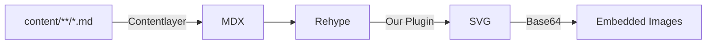

# Mermaid diagrams in a static site using MDX and Contentlayer

Who doesn't love some late holiday season yak shaving, eh? I was writing my Airbyte year in review, and _really_ needed a diagram. Remembered [[hello-world|I wanted Mermaid support for 2 years now]], and thought I can quickly get it to work.

Mermaid is a nice little Javascript library that can generate diagrams in SVG based on a text-based description in a their own DSL that folks call Mermaid. Here's an example:


```pseudo-mermaid
graph LR;
    A[content/**/*.md] -->|Contentlayer| B[MDX];
    B --> C[Rehype];
    C -->|Our Plugin| D[SVG];
    D -->|Base64| E[Embedded Images];
```

Becomes this: 



The neat part is that Mermaid works out of the box in Obsidian, too, so again — notes look the same in their source representation in my editor of choice, and on the website.

The implementation is in [this pull request](https://github.com/natikgadzhi/respawn-io/pull/10). Here's how it all works together.

## Content in `*.md` to MDX: Contentlayer

I've played around with Contentlayer for a bit, and I like it. TLDR is that it's a library that allows me to go from a bunch of markdown files to having the data from my posts as Typescript objects really quickly, and supports MDX and custom fields and transformations. [This website is built on Contentlayer!](/tags/contentlayer) 

Contentlayer has handy knobs to use unified plugins in the markdown rendering pipeline, so to get diagrams rendered nicely, we're going to do just that — a rehype plugin.


## MDX to SVG: Rehype Plugin

The job of the rehype plugin will be to take a `pre` with a `code` inside, and if it's `language=mermaid`, convert it into an inlined SVG image. Well, a bit more, but we'll get there.

There are existing plugins to do that! Namely, `rehype-mermaid`. But for some reason, it injected markup that Contentlayer MDX pipeline did not like, and I couldn't figure out why. Since there's basically a single page of code anyway, [I've yoinked it and customized it to my needs](https://github.com/natikgadzhi/respawn-io/blob/main/lib/rehypeMermaid.ts).

Note that if you do something like this, it's important that Mermaid conversion happens _before_ your syntax highlighting rehype plugin. Otherwise, the code block markup will be transformed, and the Mermaid plugin won't pick it up.

I.e. in  `unifiedPlugins.ts`, the ordering is important: 

```typescript
export const rehypePlugins = [
  [rehypeMermaid, { 
    background: "transparent", 
    className: "mermaid-diagram"
  }],
  [rehypePrettyCode, prettyCodeOptions],
];
```

That's it — at this point, running the pipeline _locally_ would work. When you're building a static site, it will walk over all Markdown posts and generate a page for each. In that process, if there is a Mermaid diagram, it would attempt to render it using `mermaid-cli`, which in turn will use Puppeteer, which in turn requires that you have a headless browser intalled and configured. _Which will be a problem at build time on Vercel_.


## Using Puppeteer with headless Chrome on Vercel

If you try to deploy the site above to Vercel, it will fail and say something like `Error: Could not find Chrome (ver. 131.0.6778.204). ...`. So, we need to either use some form of serverless Chrome wrapper (`browserless` or `chrome-aws-lambda`) or install Chrome on Vercel at your site build time. The latter is straightforward.

1. We're going to tell Vercel to install some system dependencies, and turns out, we can do that in `vercel.json`: 

   ```json
    {
        "buildCommand": "pnpm build",
        "installCommand": "dnf install -y $(cat chrome-dependencies.txt) && \ 
            pnpm install && \
            pnpm exec browsers install chrome@131.0.6778.204 --path /vercel/.cache/puppeteer",
        "framework": "nextjs"
    }
   ```

2. Notice we've extracted the list of system depencies into a text file — that's because Vercel insists your `installCommand` is under 256 characters. Here's whats inside `chrome-dependencies.txt`:

    ```text
    mesa-libgbm
    nss
    nspr
    at-spi2-atk
    cups-libs
    libdrm
    libXcomposite
    libXdamage
    libXext
    libXrandr
    libgbm
    libxcb
    alsa-lib
    atk
    gtk3
    pango
    libxkbcommon
    ```

3. Lastly, you need `puppeteer.config.json` in your project root. Here's what it looks like:

    ```json
    {
        "cacheDirectory": "/vercel/.cache/puppeteer",
        "executablePath": "/vercel/.cache/puppeteer/chrome/linux-131.0.6778.204/chrome-linux64/chrome",
        "args": [
            "--no-sandbox",
            "--disable-setuid-sandbox",
            "--disable-dev-shm-usage"
        ]
    }
    ```

    The `rehypeMermaid` plugin linked above is smart enough to only use that configuration in production builds, since locally things should work fine out of the box.

## Light and dark mode support

Mermaid supports themes, and their default theme is great for the light mode, but looks less contrasty than I'd like in dark mode. I ended up generating two diagrams from one source block. One for light, and another for dark mode, and then conditionally showing one or another based on the system preference.

Add these styles to your CSS to handle light/dark mode switching:

```css
.mermaid-diagram {
    @apply mx-auto my-8 flex items-center justify-center;
}

.mermaid-diagram img {
    @apply max-h-[300px] lg:max-h-[400px] w-auto max-w-full;
    min-height: 0;
}

.mermaid-dark {
    display: none;
}

@media (prefers-color-scheme: dark) {
    .mermaid-light {
        display: none;
    }
    
    .mermaid-dark {
        display: block;
    }
}
```

That's it! The last gotcha I have for you is that if you want to show Mermaid source code (like I did in the beginning of this post), you can just use a different language, i.e. `pseudo-mermaid` instead of `mermaid`.

```pseudo-mermaid
graph LR;
    A[content/**/*.md] -->|Contentlayer| B[MDX];
    B --> C[Rehype];
    C -->|Our Plugin| D[SVG];
    D -->|Base64| E[Embedded Images];
```


Alright, back to year in review.


## Follow-up: Excalidraw next?

Mermaid is great for _a lot of things_, it's _write source code first, then visualize_. I figured, if I want to make more flexible what you see is what you get diagrams, it should be possible to use Excalidraw files embedded into Obsidian notes, [and rendered to SVG in the same approach we render Mermaid above](https://github.com/JRJurman/excalidraw-to-svg).