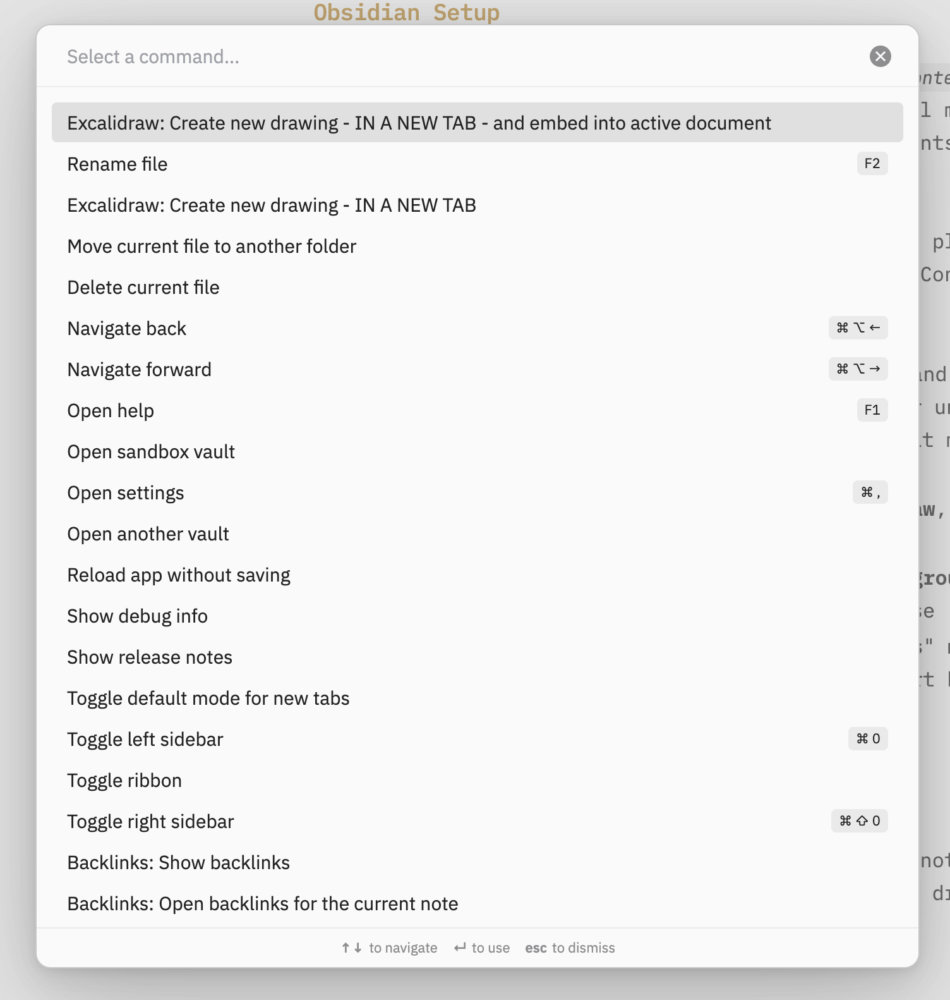

# How to Embed Excalidraw in MDX

Did I need this? Sort of. Not really. But I needed to keep my hands busy with something, so here we go.

Since I made a plugin to [[contentlayer-mermaid-diagrams|embed Mermaid diagrams in my blog posts]], I figured the more different ways I have to convey my ideas the better, and Excalidraw gives me much more visual expressiveness. So, I figured, might as well add a plugin to embed Excalidraw drawings in the posts, too. 

The caveat is that it works in a very specific scenario where you're using Obsidian with a certain attachments configuration, and [Obsidian Excalidraw plugin](https://github.com/zsviczian/obsidian-excalidraw-plugin). It's easy to extend to support embedding any downloaded `.excalidraw` files, but I didn't have to do that, so that'll be an exercise for the reader. Excalidraw Obsidian plugin exports `*.light.svg` and `*.dark.svg` versions of the drawing automatically, so if you're not using Obsidian — you'd have to add the excalidraw to svg export call to `rehypeExcalidraw.ts` below.
 

![[contentlayer-with-excalidraw 2025-03-30.excalidraw]]


## Obsidian Setup

<WithAside>
My whole blog idea is that a my _blog repository `content` directory is symlinked into the Obsidian vault_. So I edit all my posts in Obsidian, and Contentlayer has access to the contents of anything within `content` at build time.
<Aside>
Read the [[hello-world|full overview here]]!
</Aside>
</WithAside>

Assuming you already have Obsidian with Excalidraw plugin setup, we need to tweak a few settings to make sure that Contentlayer + MDX can access the drawings:

1. Go to **Obsidian → Settings → Files and Links**, and set "Default Location for New Attachments" to "in subfolder under current folder", and "Subfolder name" to something that makes sense. Mine is `assets`.
2. Go to **Settings → Community Plugins → Excalidraw**, find "Embed Excalidraw into your Notes and Export".
    1. In **Export Settings → Image theme and background color**, set "Export image with background" to false
    2. In "**Export Settings → Auto-export settings**" make sure to toggle "Auto-export SVG" to ON, and "Export both dark- and light-theme image" to ON as well.

## Embedding drawings in Obsidian

Now you can add Excalidrawings into your Obsidian notes! Use the command palette and select "Excalidraw: Create new drawing and embed into active document"



If you want to embed an existing drawing — you'd just have to move it to a spot where the blog engine can pick it up following the relative path from the `[[embed-link.excalidraw]]` in your posts.

## Rehype Plugin

Here's the rehype plugin code that I'm using that picks up wikilinks to `.excalidraw` files and embeds the SVG files instead:

```ts
import { visit } from "unist-util-visit";
import { existsSync, readFileSync } from "fs";
import { join, dirname } from "path";
import type { Plugin } from "unified";
import type { Root } from "hast";

interface ExcalidrawOptions {
  className?: string;
}

// Walks over the document tree and replaces Excalidraw wikilinks with inline SVG images
// for both light and dark theme.
const rehypeExcalidraw: Plugin<[ExcalidrawOptions?], Root> = (options = {}) => {
  return (tree, file) => {
    let paragraphsToReplace = [];

    visit(tree, "element", (node) => {
      if (node.tagName !== "p") return;

      if (node.children.length === 1 && node.children[0].type === "text") {
        const textNode = node.children[0];
        const regex = /^!\[\[(.*\.excalidraw)\]\]$/;
        
        if (regex.test(textNode.value.trim())) {
          paragraphsToReplace.push(node);
        }
      }
    });
    
    for (const paragraph of paragraphsToReplace) {
      const textNode = paragraph.children[0];
      const match = textNode.value.trim().match(/^!\[\[(.*\.excalidraw)\]\]$/);
      if (!match || !match[1]) continue;

      const diagramName = match[1];
      const parentDir = dirname(file.path);
      // Make sure this matches your Obsidian files + links directory settings
      const assetsDir = join(parentDir, "assets");
      
      const lightSvgPath = join(assetsDir, `${diagramName}.light.svg`);
      const darkSvgPath = join(assetsDir, `${diagramName}.dark.svg`);
      
      try {
        if (existsSync(lightSvgPath) && existsSync(darkSvgPath)) {
          const lightSvgContent = readFileSync(lightSvgPath, "utf-8");
          const darkSvgContent = readFileSync(darkSvgPath, "utf-8");
          
          const lightDataUrl = `data:image/svg+xml;base64,${Buffer.from(
            lightSvgContent
          ).toString("base64")}`;
          const darkDataUrl = `data:image/svg+xml;base64,${Buffer.from(
            darkSvgContent
          ).toString("base64")}`;

          paragraph.tagName = "div";
          paragraph.properties = {
            className: options.className || "excalidraw-diagram"
          };
          
          paragraph.children = [
            {
              type: "element",
              tagName: "img",
              properties: {
                src: lightDataUrl,
                className: "excalidraw-light",
                alt: `Diagram: ${diagramName}`
              },
              children: []
            },
            {
              type: "element",
              tagName: "img",
              properties: {
                src: darkDataUrl,
                className: "excalidraw-dark",
                alt: `Diagram: ${diagramName}`
              },
              children: []
            }
          ];
        }
      } catch (error) {
        console.error(`Failed to process Excalidraw diagram ${diagramName}:`, error);
      }
    }

    return tree;
  };
};

export default rehypeExcalidraw;

```


This obviously assumes that Excalidraw Obsidian plugin saves the `.svg` files for you, and their filenames match.

