# Airbyte in 2024: better extensibility primitives

I've joined Airbyte in December 2023, conveniently aligned with calendar years. Since I'm one of the (un)lucky people
who identify themselves too much with their work, here's my year in review.

<WithAside>
First, let's see how I got here. Back in 2023, I had _a wake up moment_ and realized that just wanting to work on dev tools not enough, I should probably actively do something about it. I contributed to a few things, and started talking to a few companies, [which you can guess based on what I contributed to](https://github.com/pulls?q=is:merged+is:pr+author:natikgadzhi+archived:false+updated:2023-01-01..2023-12-31) 🙃

<Aside>
Assuming `SwiftSyntax` is now bundled with `Swift` itself, a piece of code that I've written, however miniscule and insignificant, is now in every iPhone.
</Aside>
</WithAside>

Ultimately, I decided to join Airbyte as an engineering manager on Extensibility team. First few weeks, I was raging with happiness about being _in an actual open-source developer tools company_. Then the excitement of _making it_ subsided, and I started thinking “ok great, but _what exactly am I going do do here? A year from now, what am I going to have to show for it? How am I helping this company grow?_”

A full year in, a lot of it worked out, and there is now more clarity on what we will do in 2025, and why it matters.

This post is an exercise in explaining _what it is that I do in this company_ to myself, but you're welcome to join in on my innner voice conversation.


## What is Airbyte again?

To put everything Extensibility at Airbyte shipped in 2024 in perspective, let me first ELI5 outline what Airbyte is, and what are it's main constraints.

```mermaid
flowchart LR
    subgraph Sources
        api[("🌩️ APIs")]
        db[("💽 DBs")]
        files[("📂 Files")]
    end

    subgraph "Airbyte Platform"
        note("Orchestrator:<br/>- Schedules jobs<br/>- Manages and stores state<br/>- Validates data integrity<br/>- Uses Airbyte protocol")
        src["docker run source read"]
        dst["docker run destination write"]

        src --> dst
    end

    subgraph Destinations
        warehouse[("🏢 Warehouses / Lakes")]
        lake[("💽 DBs")]
        vectors[("🧮 Vector Stores")]
        destapi[("☁️ API Destinations")]
    end

    api --> src
    db --> src
    files --> src
    dst --> warehouse
    dst --> lake
    dst --> vectors
    dst --> destapi


```



- **Airbyte is a data movement platform**. It provides a set of frameworks to write _connectors_. They all talk in [Airbyte Protocol](https://docs.airbyte.com/airbyte-protocol/) to extract data from _sources_ (mostly Databases, ERP / enterprise systems, APIs), validate data consistency, and write it to _destinations_ (mostly data warehouses, data lakes, vector stores, and APIs). Users than use data downstream, in analytics (warehouses) or LLMs (vector stores) or their apps (API destinations and DBs).
- **Airbyte does not store customer data at rest**. We transfer data, apply any mappings and field or record level transformations users explicitly scheduled, and that's it.
- **Airbyte is open source**. Most connectors and connector frameworks are licensed under MIT, however Airbyte Platform is licensed under ElV2, and we have a few _enterprise-only connectors_ that are proprietary.
  <WithAside>
    <Aside>
    I'm a big fan of [FSL](https://fsl.software/), [fair.io](https://fair.io), and the [Open Source Pledge](https://opensourcepledge.com/) by folks at Sentry.
    </Aside>
    </WithAside>

A company like this has a few must-haves:
- **Airbyte is only as good as its connectors**. If the platform is great but it doesn't support the required APIs, nobody
  would use it.
- **Airbyte needs to be very easy to work with**, in any environment, for data engineers to reach for it instead of making a quick python script.
- **Airbyte has one job — move data**. We better not drop it, and we should do it very, very fast. Ideally, Airbyte should
  never be the performance bottleneck.


---

## ♻️ Extensibility Feedback Loop

Extensibility is responsible for making _any_ data available via Airbyte, in _any_ environment, quickly and easily. This includes API connector frameworks, dev tools, and the long tail of connectors.

> My team's job is to continuously work ourselves out of the job, again and again.

- **Research**: Early on, we've built our first connectors.
- **Development**: We then extracted the primitives we used into a framework, and built the GUI around it.
- **Enablement**: We've made it easy to make new connectors using our framework with contribution flow, AI assist, etc.
- **Maintenance**: We've made it easy to accept changes to existing and new connectors, and automated most of the maintenance tasks associated with them.

```mermaid
flowchart LR
    A["**Research**<br/>• Make it possible<br/>• New CDK features & performance"]
    B["**Development**<br/>• Make it easy<br/>• Connector Builder<br/>• AI Assist<br/>• Contribution flow"]
    C["**Enablement**<br/>• Make it easy to merge<br/>• Contributor engagement<br/>• Tooling<br/>• Regression testing"]
    D["**Maintenance**<br/>• Automated maintenance<br/>• Spend more time in R&D again"]

    A --> B
    B --> C
    C --> D
    D --> A

    style A text-align: left
    style B text-align: left
    style C text-align: left
    style D text-align: left

```




The team that built first few connectors managed to scale from just a dozen connectors to hundreds, and we're only getting started.

## Here's what we've shipped in 2024

### 550+ connectors

We've scaled our connector base from about 300 connectors (and 220-ish enabled on Airbyte Cloud) **to 551 connectors**
(497 enabled on Airbyte Cloud as of January 2nd).

A lot of those _we have not even built ourselves_. We got there by improving Airbyte CDK (connector development kit) and
Connector Builder to the point where folks in the community contributed more than 200 connectors.

### Connector Builder: Everything-to-no-code

We've made a strong push to make Airbyte CDK a low-code framework first, with flexible escape hatches in form of custom
components written in Python.

In 2023, we've shipped Connector Builder — the dev tool that practitioners can use to quickly make an API data
connector. Initially, we've had a page that listed out _prerequisites_ for which APIs it could work with — no graphql,
no customizations, etc etc.

In 2024, we've implemented so many features in Builder that I can't type them all out, but a few stand out. The biggest
step was fully embracing Builder in our internal team, implementing custom components support, and starting using
Builder to maintain our connectors internally.

You can imagine how a bunch of Python engineers would react if you say you're about to take their VSCode away from them. _But the less code we have to own and maintain in each individual connector, the better._ And turns out, VSCode is suboptimal when editing huge YAML files that specify which components of the framework to use for which streams, and how to normalize endpoint data schemas, etc/ Builded gives us:

- YAML connector manifest validation.
- Quick feature iteration.
- Formatting, lintint, etc out of the box.

### Connector Builder: Fork & Contribution Flows

<WithAside>
In both Airbyte Cloud, and the open source version, Builder now has a button to _make a pull request with any connector that a user made themselves_. Yeah, that's pretty much how we scaled from 220 to 500.
<Aside>
I even made a [YouTube video](https://www.youtube.com/watch?v=q2LLL5g5k3o) about it! Publishing quick draft grade videos on YouTube is also a new concept for 2024 for me.
</Aside>
</WithAside>

When our users see a connector bug, or want to add a new _stream_ (endpoint) support to an existing connector — they can one-button “fork” an existing connector from our catalog in Connector Builder, edit it, and publish their own version to their workspace, or contribute it back to mainline catalog! Contribution flow makes  a Github PR programmatically, and these pull requests have to pass our standard CI checks and connector validations.


Speaking of the catalog, we now show success rates and usage rates (i.e. how many people use conncetors, and did they
actually work) for each connector in our catalog. I have the data for per-stream level, which I think will be much more
useful, but it's a 2025 problem.

### Connector Builder: AI Assist

<WithAside>
We've built our own LLM-backed co-pilot-style AI assist, and it's live, available to anyone on Airbyte Cloud. No wait-lists. No cherry-picking good results. It's out there!
<Aside>
[We've worked with Fractional.AI on this](https://www.fractional.ai/case-study/api-integrations-in-minutes-how-fractional-ai-airbyte-10xd-the-speed-of-building-connectors), and I've learned quite a lot from them. They are awesome to work with, and I highly recommend them if you need to take heavily LLM-based projects from a prototype to actual production.
</Aside>
</WithAside>

We needed to make it 10x easier to make new connectors, again. Airbyte CDK makes it _possible_, but it takes days. Builder — hours. AI Assist + Builder — minutes ✨

- With Airbyte CDK, folks can make connectors for any APIs that we did not yet support without hours to days.
- With Connector Builder, making a connectors becomes doable in 30 minutes to a few hours.
- AI Assist takes API vendor's docs website link, and then fills out most fields that the user needs to make connector work.


> We've made several attempts to make LLM-backed connector development possible. First two were unsuccessful, and there are other attempts at generating either `openapi` specs, or full on Airbyte connector `manifest.yaml` files given documentation links or `openapi` specs. We could not get this approach to scale well, so we had to go much deeper, and came up with co-pilot style approach with completions and suggestions for each individual field.

### Connector Tooling and Automated Maintenance

Since it's easy to make new connectors and change existing ones, we needed tooling to be able to review, accept, merge the changes, and maintain hundreds more connectors, ideally — automatically.

If there is a common topic in all of this, it's that the number of connectors per engineer on my team must skyrocket:

- When you have 20+ relatively complex Python applications (connectors) for the most popular APIs out there, maintaining _that_ is troublesome.
- But if most connectors are just YAML, maintaining this should be straightforward. Leverage! Automate YAML maintenance, then convert everythong to a bunch of yaml.
- **So we've made a few new flows in `airbyte-ci` that attempted upgrading all dependencies for Python and Manifest connectors weekly**, generated a PR for each (Dependabot-style), and if they passed all our required integration tests — those PRs would be merged automatically.
- This system got us to the point where rolling out a framework or base image change to connectors takes about a couple of weeks, but it's fully automated!
- We got our CI to run full set of checks on pull requests from community members. **Time to review and merge a
  community PR fell from several weeks to a couple of days**.

#### Progressive Rollouts

We've also made a system that allows us to ship release candidate versions of our connectors to Airbyte Cloud
_progressively_. I.e. try out on a few connections first, and if it works fine — roll out for more. The more popular the connector, the more cautious the rollout.

Our revenue more than trippled this year, and our userbase grows fast. We don't want to break things, and we don't want to get paged in the middle of the night if the action required to remediate the incident is a simple rollback — robots can take care of that for us now.

### Airbyte CDK Performance

In early 2024, Airbyte CDK was a collection of patterns that we've accumulated from working on a bunch of connectors that we only started to put in shape. We've moved quickly and took some tech debt. I'd do it again in no time, but it was time to pay up.

At some point, we've made a strong push for concurrency and performance, and sped up our CDK from having a performance ceiling of 1.5mb/s to about 15mb/s (with a handful of caveats). This is still slow IMO, but for API connectors, it's decent. Now we've got to use the systems above go ensure all our streams in all connectors are on the latest version of the CDK, and boom.

> Having the no-code framework backed by Airbyte CDK gives us incredible leverage: tune performance once, and get the full fleet of connectors suddenly working 5x faster.

### OAuth apps support on Airbyte Open Source

Early on, Airbyte Protocol had affordances for connectors to express that they require a full auth token OAuth flow, and
provide redirect URLs, etc. But the actual flows for most popular connectors were actually part of the platform
implementation, and the actual application secrets were passed in as env variables to the platform.

Just a couple weeks ago, the last thing we shipped to Connector Builder and Connector Marketplace is that you can now
setup your own OAuth application for connectors that already provide their OAuth spec!

<WithAside>
To top that off, you can now express full OAuth flows in Connector Builder, too. Airbyte will host your redirect URLs, and you can express the code generation logic with string interpolations.
<Aside>
This is live on Cloud, but will land in Airbyte OSS 1.4.

TODO: Add a link to docs once we release them. No seriously, we haven't shipped new docs for this yet /shrug.

</Aside>
</WithAside>

### Airbyte CDK is more open now

`airbytehq/airbyte` repo has a LOT going on. It's a mixed bag with all our connector CDKs (Python, OG Java CDK, and the new Bulk Extract Kotling CDK), connector publishing pipeline, `airbyte-ci`, and a bunch of other internal stuff.

Early on, monorepo approach gave us a lot for free, and we got away with some cheap tooling shortcuts. But as we grow, we have too much ✨ Airbyte Magic Cruft ✨ that makes it very difficult for newcomers to contribute. That is an absolute community killer. We can't say that we _really really_ want your contributions, but then turn around and with serious face say that our CI cannot run on your PRs because you're not on the team.

<WithAside>
So, we've moved `airbyte-cdk` into it's own new repository, [`airbytehq/airbyte-python-cdk`](https://github.com/airbytehq/airbyte-python-cdk), and aligning all our public codebases with industry standard approaches. We finally don't need an airbyte-specific `airbyte-ci format fix all` as part of our CI, and can just use Ruff. The goal is to make it easier to navigate and contribute to, and easier to build on, if you do indeed have to use the Python CDK directly.
<Aside>
I love when folks contribute to the CDK, please do! If you're looking for something interesting to work on in there, feel free to reach out. While we have some `good-first-issues`, I know our issue documentation might not be the greatest.
</Aside>
</WithAside>

### Vector Store Destinations

2024 undoubtfully was a year of LLM craze, so Airbyte Python CDK got the knobs to write to popular vector stores.
Together with folks in the community, we've also shipped a bunch of them. Airbyte now supports writing to [PGVector](https://docs.airbyte.com/integrations/destinations/pgvector#pgvector-destination), [Pinecone](https://docs.airbyte.com/integrations/destinations/pinecone#pinecone), [Chroma](https://docs.airbyte.com/integrations/destinations/chroma#chroma), [Weaviate](https://docs.airbyte.com/integrations/destinations/weaviate#weaviate), to name a few.

## Airbyte 1.0

Enough ebout Extensibility,
[Airbyte as a whole hit some serious milestones, and released great features](https://airbyte.com/blog/airbytes-journey-until-1-0). [Same, but a YouTube video](https://www.youtube.com/watch?v=ude_G1Z28SE).

Things that stood out to me are improvements in developer experience for folks who are using Airbyte: deploying with `abctl`, and using Airbyte as a Python library _without deploying the platform at all_ via `PyAirbyte`.

### `abctl`

When we just got started, Airbyte ran on both Docker and K8s. It became very cumbersome to support both, and we opted to clean out Docker Compose from the platform. This means that even in development we're running Airbyte in a local K8s cluster, and that to deploy Airbyte, you'd run a K8s cluster.

<WithAside>
[`abctl` (pronounced, obviously, ayy-bee-cuddle) is the little helper tool](https://github.com/airbytehq/abctl) that abstracts most of the K8s setup away by using `kind` (K8s in Docker), and allows users to `abctl local install` and get started quickly.

[Here is a quick video about it](https://www.youtube.com/watch?v=yl_SCzZQ-zI)

<Aside>
Contributions are very welcome, btw! If you like Go more than Kotlin, Java, and Python — `abctl` is the thing you can get started with contributing to ;-)
</Aside>
</WithAside>

### `PyAirbyte`

The biggest PITA with Airbyte, according to folks on `r/dataengineering` is that it's, quote, “over-engineered overbloated pile of crap”. OP hurt my feelings, but there's kernel of truth there — we've built Airbyte to be extensible and flexible, and _it does not appreciate the beauty of running on a $5 VPS on Hetzner_.

So we pulled off the reverse-pimp-my-ride maneuver and made Airbyte without Airbyte, so you can use Airbyte connectors while you don't have Airbyte Platform per-se. Since connectors just expect their client to be able to consume messages they emit in `AirbyteProtocol`, we've made a Python library that does just that.

It's in [`airbytehq/pyairbyte`](https://github.com/airbytehq/pyairbyte), and it also has a strong little community going on. `@aaronsteers` takes working with contributors seriously, and
[has a bunch of issues marked with `accepting pull requests` and `good first issue`](https://github.com/airbytehq/PyAirbyte/issues?q=is:issue%20state:open%20label:%22accepting%20pull%20requests%22)
🖤

What's so cool about it? Well, here's how you can use any Airbyte connectors without installing Airbyte platform:

```python
from airbyte import get_source

source_manifest_dict = cast(dict, yaml.safe_load(SOURCE_MANIFEST_TEXT))

print("Installing declarative source...")
source = get_source(
    "source-rick-and-morty",
    config={},
    source_manifest=source_manifest_dict,
)
source.check()
source.select_all_streams()

result = source.read()
```

PyAirbyte is using DuckDB to cache data locally, so you sort of get a local destination as well. PyAirbyte also works in Jupyter Notebooks and Colab — `%pip install airbyte` should be enough.

<iframe width="560" height="315" src="https://www.youtube.com/embed/7tMr3U-_epI?si=0sA3ZelPZtMpD3fA" title="YouTube video player" frameborder="0" allow="accelerometer; autoplay; clipboard-write; encrypted-media; gyroscope; picture-in-picture; web-share" referrerpolicy="strict-origin-when-cross-origin" allowfullscreen></iframe>

## I'm hiring btw

We have lots of work in 2025, ranging from improving AI Assist, making low-code destinations engine, Connector Builder for destinations, to enabling engineers to plug their data into LLM use cases.

Extensibility team is hiring! I'm looking for both front-end and back-end engineers, San Francisco hybrid 3 days a week in-office.

If the work above sounds exciting, reach out.
